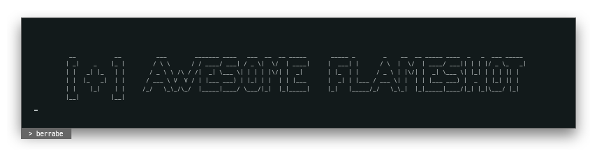
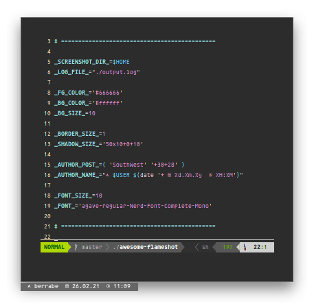
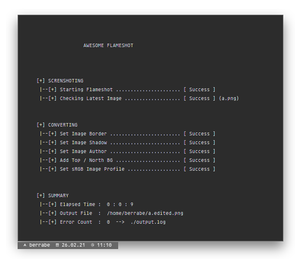

<p align="center">
  
</p>

<br/><br/>

### 1 - INTRO
---
So, what kind of script is this?

This shell script, will convert the screenshots taken by the Flameshot program into awesome image. 
This script was built and ported from the Ruby script created by [Bandithijo](https://bandithijo.github.io/blog/memodifikasi-screenshot-dari-flameshot-dengan-imagemagick)

**⚠️ Note : Make sure the flameshot (v0.9.0+), xclip (0.13+) and imagemagick (7.0.11-5+) is already installed on your linux system**

<br/><br/>

### 2 - SETUP
---
- the simple steps needed to use this script, all you have to do is download the script

```sh
> wget https://raw.githubusercontent.com/berrabe/awesome-flameshot/master/awesome-flameshot
> chmod +x awesome-flameshot
```

<br/>

- and at the top of the script, there is a configuration that you can adjust according to your taste

<p align="center">
  
</p>


<br/><br/>

### 3 - USAGE
---
- All you have to do is run a simple command. And the rest, the script will do it for you. **Make sure the flameshot program is already running in the background**

```sh
> ./awesome-flameshot
```

<br/>

- and the output will be like this

<p align="center">
  
</p>


<br/><br/>